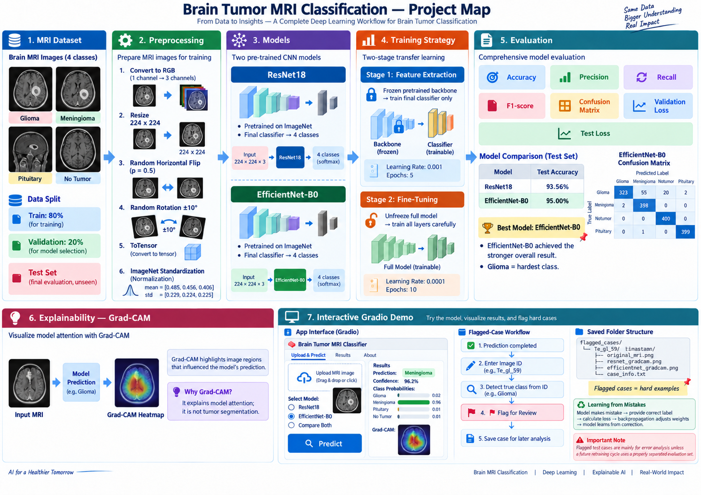
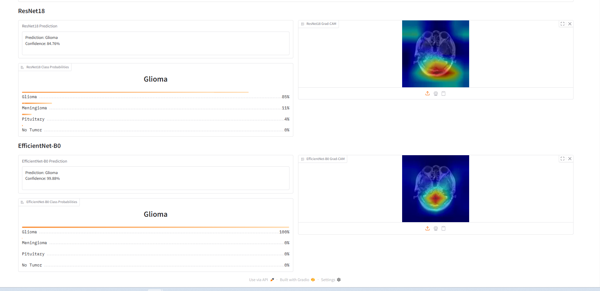
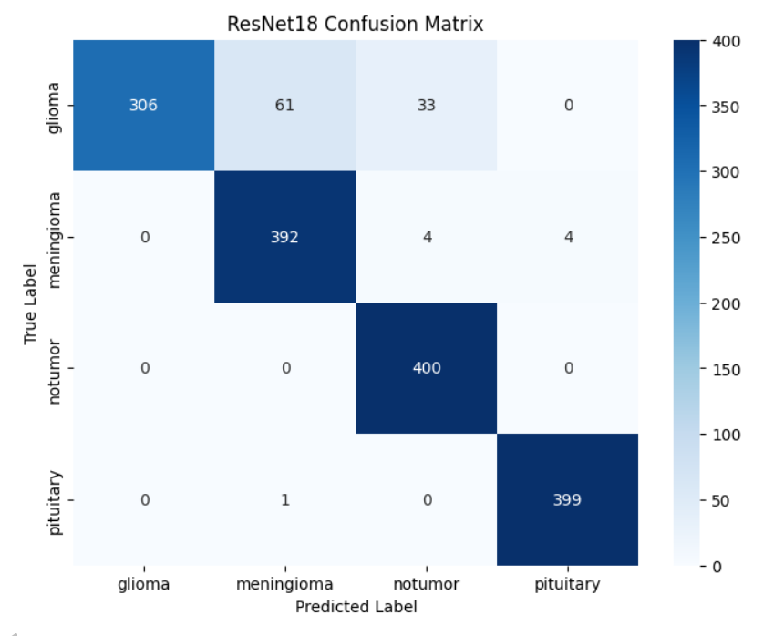
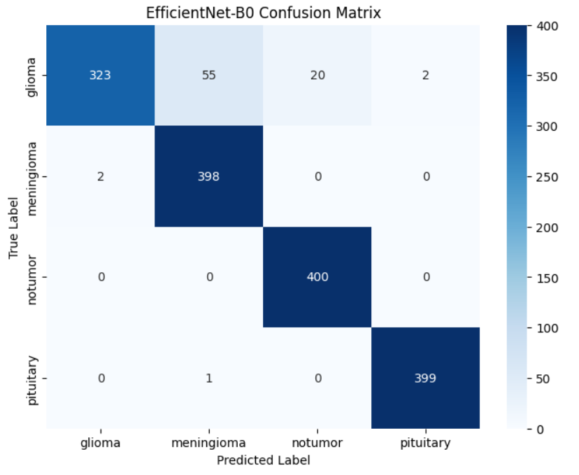
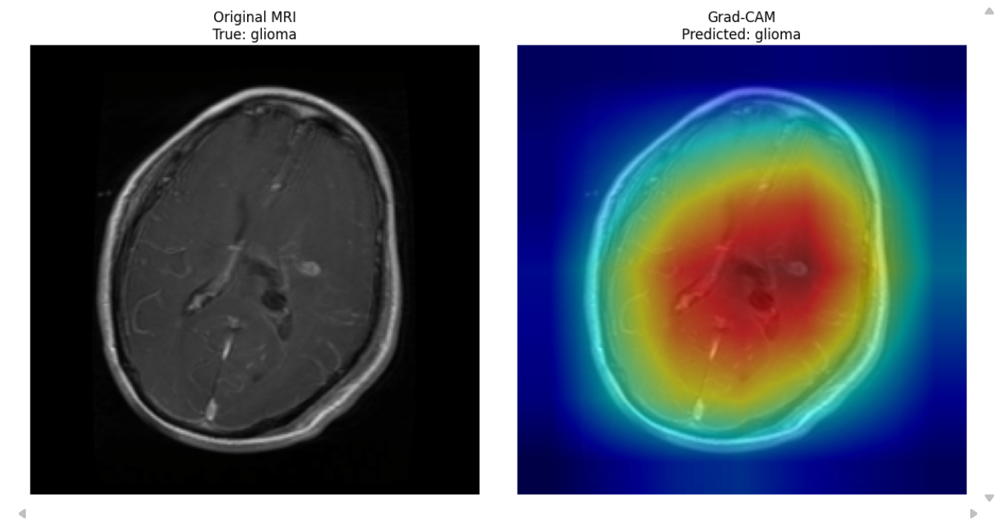
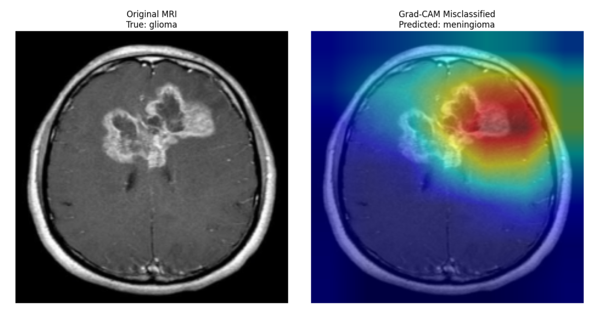
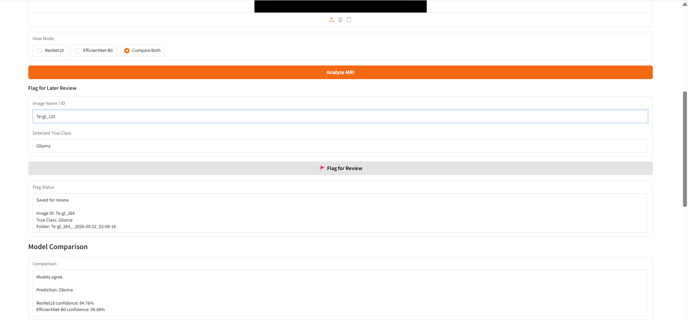

# Brain Tumor MRI Classification

A deep learning project using PyTorch to compare **ResNet18** and **EfficientNet-B0** for four-class brain MRI classification: **glioma, meningioma, no tumor, and pituitary**. It combines transfer learning, model evaluation, Grad-CAM explainability, and an **Interactive Gradio Interface** for exploring predictions and saving difficult cases for review.

To run the interface, follow [Try the models — no retraining required](#try-the-models--no-retraining-required) below.

**Pipeline:** MRI images → preprocessing → transfer learning → fine-tuning → evaluation → Grad-CAM → interactive Gradio interface

**Recorded test accuracy:** ResNet18 **93.56%** · EfficientNet-B0 **95.00%**

> Educational and research project. Not intended for medical diagnosis or clinical decision-making.



## Explore the project

| File | Purpose |
| --- | --- |
| [Brain_Tumor_MRI_Classification.ipynb](Brain_Tumor_MRI_Classification.ipynb) | Exploration, preprocessing, training, evaluation, model comparison, and Grad-CAM |
| [Brain_Tumor_Gradio_Demo.ipynb](Brain_Tumor_Gradio_Demo.ipynb) | Standalone interactive interface and flagged-case workflow |
| [best_resnet18.pth](best_resnet18.pth) / [best_efficientnet_b0.pth](best_efficientnet_b0.pth) | Saved model weights selected by validation loss |
| [Brain_Tumor_MRI_Classification_Report.docx](Brain_Tumor_MRI_Classification_Report.docx) | Academic methodology, interpretation, limitations, ethics, and related research |
| [BT_MRI_Class_Project_Map.png](BT_MRI_Class_Project_Map.png) | Visual workflow overview |
| [requirements.txt](requirements.txt) | Python dependencies |
| [.gitignore](.gitignore) | Repository exclusion rules |

**The main notebook explains the reasoning alongside the implementation.** Markdown explanations and justifications follow relevant code cells, connecting each step to its purpose, results, and limitations.

## Try the models — no retraining required

> **Download the interface notebook + both saved weights, run the cells, and upload an MRI image.** You do not need the training notebook or the full dataset.

1. Download these three files into the same folder:
   - [Brain_Tumor_Gradio_Demo.ipynb](Brain_Tumor_Gradio_Demo.ipynb)
   - [best_resnet18.pth](best_resnet18.pth)
   - [best_efficientnet_b0.pth](best_efficientnet_b0.pth)
2. For first-time setup, also download [requirements.txt](requirements.txt) and install the dependencies using the command under [Run locally](#run-locally).
3. Open the notebook in Jupyter or VS Code, use that folder as the working directory, and run the cells in order.
4. Open the displayed Gradio URL, upload an MRI image, and choose **ResNet18**, **EfficientNet-B0**, or **Compare Both**.

**The interface launched in ~20 seconds after setup.** Loads saved weights without retraining and runs on CPU or CUDA. Launch time varies by machine.

**Interactive Gradio Interface**

Compare both models, view predictions and Grad-CAM heatmaps, and flag cases for later review.



## Dataset and preprocessing

The project report identifies the source as the [Kaggle Brain Tumor MRI Dataset](https://www.kaggle.com/datasets/masoudnickparvar/brain-tumor-mri-dataset). The local dataset used for the recorded experiment contains **7,200 images**, balanced across four classes.

The original 5,600-image training folder is divided using a **stratified 80/20 split**. The separate testing folder is reserved for final evaluation.

| Split | Images | Images per class |
| --- | ---: | ---: |
| Training | 4,480 | 1,120 |
| Validation | 1,120 | 280 |
| Testing | 1,600 | 400 |

Images are converted to RGB, resized to **224 × 224**, converted to tensors, and normalized using ImageNet statistics. Training images also receive random horizontal flips and rotations of up to **±10°**. Validation, testing, and interface inference use fixed preprocessing without augmentation.

## Training strategy

Both models start with ImageNet-pretrained weights and a new **4-class output**. They use the same split, batch size of **32**, Adam optimizer, and cross-entropy loss.

| Stage | Trainable parameters | Epochs | Learning rate |
| --- | --- | ---: | ---: |
| Feature extraction | **Freeze** backbone parameters; train the classifier | 5 | 0.001 |
| Fine-tuning | **Unfreeze** all layers; train the full model | 10 | 0.0001 |

During fine-tuning, the checkpoint with the **lowest validation loss** is saved and later loaded for test evaluation. The classifiers output four logits; softmax converts them into probabilities for display in the interface.

## Results

| Model | Best validation loss | Selected epoch¹ | Test loss | Test accuracy |
| --- | ---: | ---: | ---: | ---: |
| ResNet18 | 0.0465 | 11 | 0.4325 | 93.56% |
| EfficientNet-B0 | 0.0184 | 15 | 0.3529 | **95.00%** |

¹ Epochs count both training stages.

The notebook includes learning curves, class-level precision/recall/F1, confusion matrices, and Grad-CAM examples for correct and incorrect predictions.

## Key findings

- **EfficientNet-B0 performed better in the recorded run**, with higher test accuracy and lower test loss. This does not establish consistent superiority across datasets.
- **Glioma remained the hardest class.** Reported glioma recall improved from **0.77** with ResNet18 to **0.81** with EfficientNet-B0.
- **Overall accuracy hides important errors.** Both models identified all actual no-tumor test images, but some tumor images were also predicted as no tumor.
- **Grad-CAM supports error analysis** by highlighting regions influencing correct and incorrect predictions.

### Confusion matrices

Rows show the true class; columns show the predicted class. Each row contains 400 test images.

| ResNet18 | EfficientNet-B0 |
| --- | --- |
|  |  |

Glioma accounts for most errors. EfficientNet-B0 correctly classified **323/400** glioma images, compared with **306/400** for ResNet18.

### Grad-CAM examples

**Correct prediction:** a glioma image classified as glioma.



**Misclassified prediction:** a glioma image classified as meningioma.



Heatmaps highlight regions influencing the predicted class; they do not mark exact tumor boundaries or establish that the prediction is medically correct.

## Interactive Gradio Interface

Run either model individually or compare both on the same image. The interface displays the **predicted class, confidence, all four class probabilities, and Grad-CAM overlays**, plus model agreement or disagreement in comparison mode.

**Confidence is the model's score for one uploaded image; test accuracy measures performance across the test set.** A high-confidence prediction can still be wrong.

### Flagged cases for review

**Analyze image → enter image ID → flag for review → save locally**

The image ID is used only for review metadata and is **not passed to either model**. Recognized filename codes, such as `gl` in `Te-gl_59`, provide an inferred class label; unrecognized IDs return `Unknown`. This is filename-derived metadata, not independently verified ground truth.

Each case is saved under `flagged_cases/<image_id>__<timestamp>/` with:

- `original_mri.png`
- `resnet_gradcam.png` and/or `efficientnet_gradcam.png`, depending on the selected mode
- `case_info.txt`: image ID, inferred label, timestamp, mode, predictions, confidence, and available comparison text

**Flagging does not retrain or update the models.** Future training use requires verified labels and a separate evaluation set, particularly when flagged images came from the test set.



## Limitations

- **Testing on new data:** The models were evaluated on a public dataset, not independent hospital data. Results may differ with other MRI scanners, scan settings, or patient groups.
- **Data separation:** We have not confirmed whether images from the same patient or duplicate images appear across the training, validation, and test sets.
- **Glioma errors:** Glioma was the hardest class for both models. Some glioma images were incorrectly classified as meningioma or no tumor.
- **Limited information:** The models use individual MRI images without patient history or other clinical information. The project also has no segmentation masks marking the exact tumor area.
- **Confidence and Grad-CAM:** A high confidence score does not guarantee a correct prediction. Grad-CAM highlights areas influencing the prediction; it does not show exact tumor boundaries or prove medical correctness.
- **Results from one run:** The reported scores come from one training run, not an average of repeated runs.

Good results on this dataset do not mean the models are ready for medical use. Further testing on independent hospital data and review by medical experts are needed before considering such use.

## Run locally

Install dependencies in the Python environment used by your notebook:

```bash
python -m pip install -r requirements.txt
```

For the interface, follow the quick-start steps above. To rerun training and evaluation, prepare this dataset layout and open the main notebook from the repository root:

```text
Brain Tumor MRI Dataset/
├── Training/
│   ├── glioma/
│   ├── meningioma/
│   ├── notumor/
│   └── pituitary/
└── Testing/
    ├── glioma/
    ├── meningioma/
    ├── notumor/
    └── pituitary/
```

Run the main notebook sequentially. Its device-information cell currently calls CUDA directly, so CPU-only training requires adjusting that cell; the separate interface already supports CPU. Training downloads pretrained weights if needed and overwrites the checkpoint files when validation loss improves.

**Reproducibility:** The split uses `random_state=42`, but training is not fully seeded and dependency versions are not pinned. Training randomness, hardware, and library versions can change rerun results.

**Built with:** Python, PyTorch, torchvision, scikit-learn, NumPy, pandas, Matplotlib, Seaborn, Pillow, Grad-CAM, Gradio, and Jupyter.

Developed for a university **Bioinformatics and Clinical Data Analysis** course and refined for portfolio presentation.
